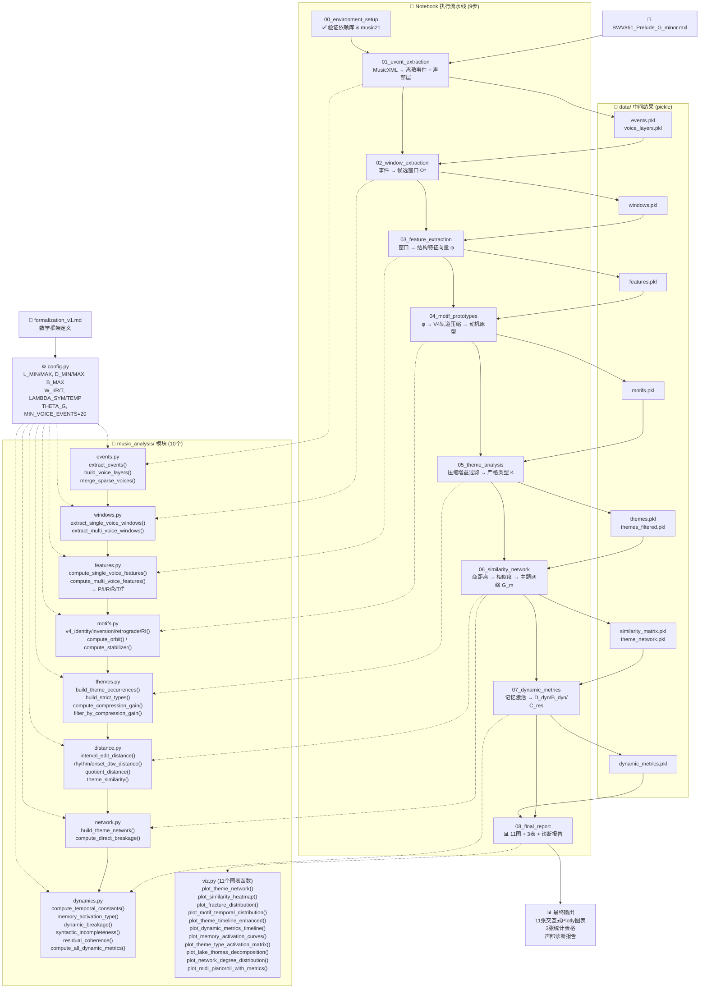

# BWV861 音乐形式化分析 — 项目思维导图



---

## 模块速查表

### Python 模块 (`music_analysis/`)

| 模块 | 行数 | 核心职责 | 被谁调用 |
|------|------|----------|----------|
| `config.py` | ~30 | 全局超参数（窗口约束、权重、阈值） | 所有模块 |
| `events.py` | ~100 | MusicXML → 离散事件 `(p_n, o_n, d_n, s_n, v_n)`；声部层构建与合并 | NB01 |
| `windows.py` | ~100 | 候选窗口提取，含 L/D/B 约束 + 同音高打结检测 | NB02 |
| `features.py` | ~60 | 窗口 → 结构特征 φ = (P,I,R,R̂,T,T̂) | NB03 |
| `motifs.py` | ~80 | V4 群作用（Identity/Inversion/Retrograde/RI）+ 轨道压缩 | NB04 |
| `themes.py` | ~120 | 主题出现构建、严格类型归类、压缩增益过滤 | NB05 |
| `distance.py` | ~100 | 商距离（interval edit + rhythm DTW + onset DTW）→ 相似度矩阵 | NB06 |
| `network.py` | ~60 | 主题网络 G_m（sym + temporal edges）+ B_direct 断裂度 | NB06 |
| `dynamics.py` | ~120 | τ_𝔇 时间常量、记忆激活 A_i(t)、D_dyn/B_dyn/Ĉ_res/U_cad | NB07 |
| `viz.py` | ~500 | 11 个 Plotly 交互图表函数 | NB08 |

### Notebook 流水线

| # | Notebook | 输入 | 输出 | 预计耗时 |
|---|----------|------|------|----------|
| 00 | `environment_setup` | — | 验证环境 | 10s |
| 01 | `event_extraction` | `.mxl` | `events.pkl`, `voice_layers.pkl` | 5s |
| 02 | `window_extraction` | `events.pkl` | `windows.pkl` | 10s |
| 03 | `feature_extraction` | `windows.pkl` | `features.pkl` | 5s |
| 04 | `motif_prototypes` | `features.pkl` | `motifs.pkl` | 5s |
| 05 | `theme_analysis` | `motifs.pkl` | `themes.pkl`, `themes_filtered.pkl` | 5s |
| 06 | `similarity_network` | `themes_filtered.pkl` | `similarity_matrix.pkl`, `theme_network.pkl` | 1s |
| 07 | `dynamic_metrics` | `theme_network.pkl` | `dynamic_metrics.pkl` | 5s |
| 08 | `final_report` | 全部 `.pkl` | 11 图表 + 3 表格 + 诊断 | 15s |

---

## 数据流简图

```
BWV861.mxl
    │
    ▼
[01] events.py ──→ events.pkl, voice_layers.pkl
    │
    ▼
[02] windows.py ──→ windows.pkl
    │
    ▼
[03] features.py ──→ features.pkl
    │
    ▼
[04] motifs.py ──→ motifs.pkl
    │
    ▼
[05] themes.py ──→ themes.pkl ──→ themes_filtered.pkl (压缩增益)
    │
    ▼
[06] distance.py ──→ similarity_matrix.pkl
     network.py  ──→ theme_network.pkl
    │
    ▼
[07] dynamics.py ──→ dynamic_metrics.pkl
    │
    ▼
[08] viz.py ──→ 11张图表 + 报告
```

---

## 关键公式 → 代码映射

| 公式 (formalization_v1.md) | 实现位置 |
|---------------------------|---------|
| ω = (p, o, d, s, v) 事件定义 | `events.py:extract_events()` |
| Ω* 候选窗口 (L/D/B 约束) | `windows.py` |
| φ = (P, I, R, R̂, T, T̂) 特征向量 | `features.py` |
| V4 群作用 (I, R, RI) | `motifs.py:v4_*()` |
| 压缩增益 ΔL | `themes.py:compute_compression_gain()` |
| d_Q([ω], [ω′]) 商距离 | `distance.py:quotient_distance()` |
| G_m = (V_m, E_sym ∪ E_temp) | `network.py:build_theme_network()` |
| B_direct 直接断裂度 | `network.py:compute_direct_breakage()` |
| A_i(t) 记忆激活 | `dynamics.py:memory_activation_type()` |
| D_dyn = B_dyn · E_cont · U_cad / Ĉ_res | `dynamics.py:compute_all_dynamic_metrics()` |
| ℓ = mean(1-s_ij) 相似度尺度 | `distance.py:theme_similarity()` |
